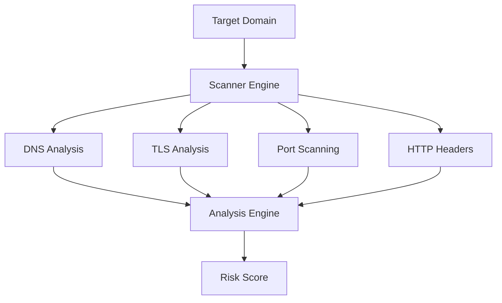

<!-- 🔥 3D Animated Header -->

<p align="center">
  
</p>

<p align="center">
  
</p>

---

## 🧠 PROFILE

```diff
+ SOC Operations 
+ Cybersecurity Student
+ Threat Detection
+ Offensive Security
```

I build systems. I break systems. Then I understand them.

This is not theory-driven learning — this is **lab-driven, attack-simulated, detection-focused cybersecurity engineering**.

---

## ⚔️ CORE DOMAINS

SOC Monitoring
Threat Detection
Network Exploitation
Web Security
Security Automation

---

## 🧰 PROJECTS

### 🔴 AlertMatrix — Domain Attack Surface Scanner

```diff
+ Multi-surface security analysis engine
+ Risk scoring (0–100)
+ Automated vulnerability detection
```



⚙️ Stack:  
React | Node.js | FastAPI | MongoDB

🔗 https://github.com/GadeKuldeep/AlertMatrix

---

### 🔵 Red-Blue-Team Lab — Attack vs Detection Environment

```diff
+ Real attack simulation
+ SIEM-based monitoring
+ Incident documentation workflow
```

🖥️ Environment:

kali-linux (attacker)  
ubuntu-server (target)  
wazuh (SIEM)  
dvwa (web vuln app)

🛠 Tools:

nmap metasploit sqlmap hydra nikto

🔗 https://github.com/GadeKuldeep/Red-Blue-Team-Lab-Setup

---

### 🟡 PicoCTF Writeups & Practice — Exploitation Knowledge Base

```diff
+ Structured CTF solutions
+ Real-world vulnerability exposure
+ Beginner-to-advanced progression
```

📂 Structure:

Cryptography/  
Web_Exploitation/  
Reverse_Engineering/  
Forensics/  
Binary_Exploitation/  
General_Skills/

🛠 Tools:

python bash wireshark burpsuite ghidra nmap metasploit

⚠️ Legal Use Only — CTF & Lab Environments

🔗 https://github.com/GadeKuldeep

---

### 🟣 CyberDocii — Cybersecurity Documentation Engine

```diff
+ Structured writeups
+ SOC incident logging
+ Pentest documentation
```

⚙️ Stack:  
React | Node.js | MongoDB

🔗 https://github.com/GadeKuldeep/CyberDocii

---

## 🏆 CERTIFICATIONS

```diff
+ Cisco CyberOps Associate
+ Junior Cybersecurity Analyst
+ Introduction to Cybersecurity
+ NPTEL Java Programming
```

---

## ⚙️ TECH STACK

### 🔐 Security

nmap metasploit burpsuite sqlmap hydra nikto wireshark wazuh

### 💻 Development

python javascript node react express fastapi mongodb mysql

### 🖥 Platforms

kali-linux ubuntu virtualbox git postman

---

## 📊 GITHUB STATS

<p align="center">
  
  
</p>

---

## 🌐 CONNECT

LinkedIn: linkedin.com/in/kuldeep-gade-52598b2b0  
TryHackMe: tryhackme.com/p/gadekuldeep25

---

## 🧬 PHILOSOPHY

"Understand the attack. Build the defense. Repeat until unbreakable."

---

<p align="center">
  
</p>
